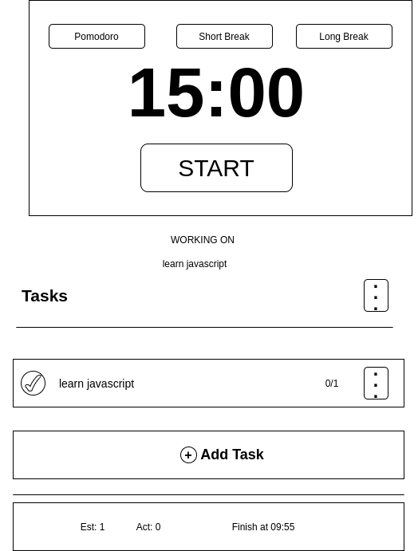

# Reverse-Engineer pomofocus.io

- Pomofocus is a customizable pomodoro timer that developed using javascript on applying asynchronous Programming.
- The aim of this app is to help you focus on any task you are working on, such as study, writing, or coding. This app is inspired by Pomodoro Technique which is a time management method developed by Francesco Cirillo.

---

## WIREFRAME

---

## 0.Setup

**A User can see my initial repository and live demo**

### Repository

- Created a new repository from this [template](https://github.com/HackYourFutureBelgium/starter-basic-import-export)
- Clone the repository
- Add a wireframe
- Start the development strategy
- Write initial, basic README
- Push the changes to GitHub
- Turn on GitHub Page
- Put reference to the project in the project board

---

## 1. Initialize Application

__As a user I want to see the initial page when I load the site__

### REPO

- This user story is developed on branch `initial-application`.
- This branch is merged to `master` branch after completion.

### HTML
- Add a `nav` element

#### CSS
- Add some styling
---

## 2. User Story: Add task

__As a user I want to be able to add tasks to work on today and also set estimate pomodoros (1 = 25min of work) for each tasks__

- _Given I have initial page open I should be able to type into the input field and add a new task to the list to work on today_

### REPO

- This user story is developed on branch `add-task`.
- This branch is merged to `master` branch after completion.

### JS

- Add Task class

## HTML

- Add task-container div

## CSS

- Add some styling.

---

## 3. User Story: Toggle done

__As a user I want to be able to toggle a task as done__

- _Given I have initial page open I should be able to toggle tasks as done_

### REPO

- This user story is developed on branch `toggle-done`.
- This branch is merged to `master` branch after completion.

### JS

#### LISTENER

- Attach a listener to ´li´ element

#### HANDLER

- Add toggleHandler function

## CSS

- Add complete class

---

## 4. User Story: Delete task

__As a user I want to be able to delete tasks__

- _Given I have initial page open I should be able to delete tasks_

### REPO

- This user story is developed on branch `delete-task`.
- This branch is merged to `master` branch after completion.

### JS

#### HANDLER

- Add delete handler to remove a task

### CSS

- Add some styling

---

## 5. User Story: Start and stop timers

__As a user I want to be able to start timer and focus on the task for 25 minutes then take a break for 5 minutes when the alarm ring__

- _Given I have initial page open I should be able to start timer and focus on the task for 25 minutes then take a break for 5 minutes when the alarm ring_

### REPO

- This user story is developed on branch `start-stop-timer`.
- This branch is merged to `master` branch after completion.

### HTML
- Add buttons and textbox

### CSS
- Add some styling

### JS
- Add timer script that contain timer class
- update init script

#### DATA

#### LISTENER
- Add listeners for start-stop, pomodoro, short brak and long break buttons.

#### HANDLER
- add start-stop, pomodoro, short brak and long break handlers

### Assets
- Add sounds directory and sound files.

---

